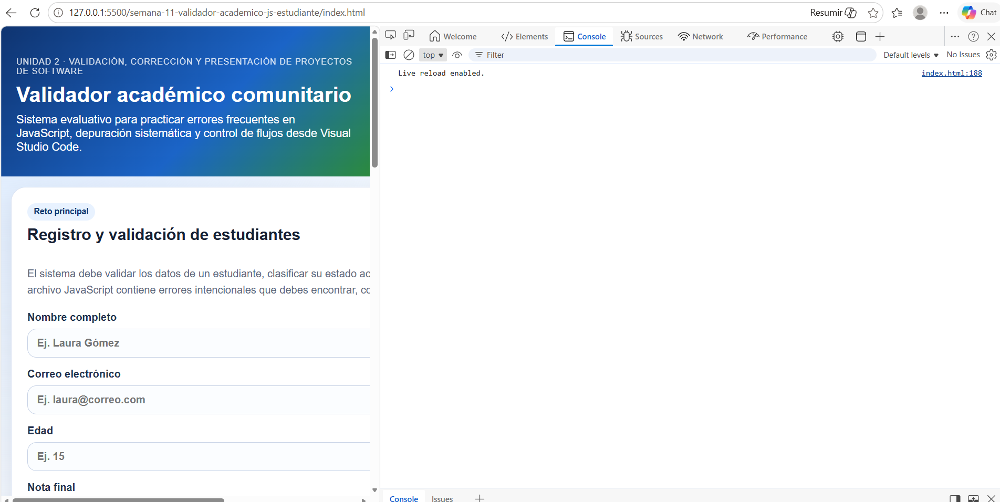
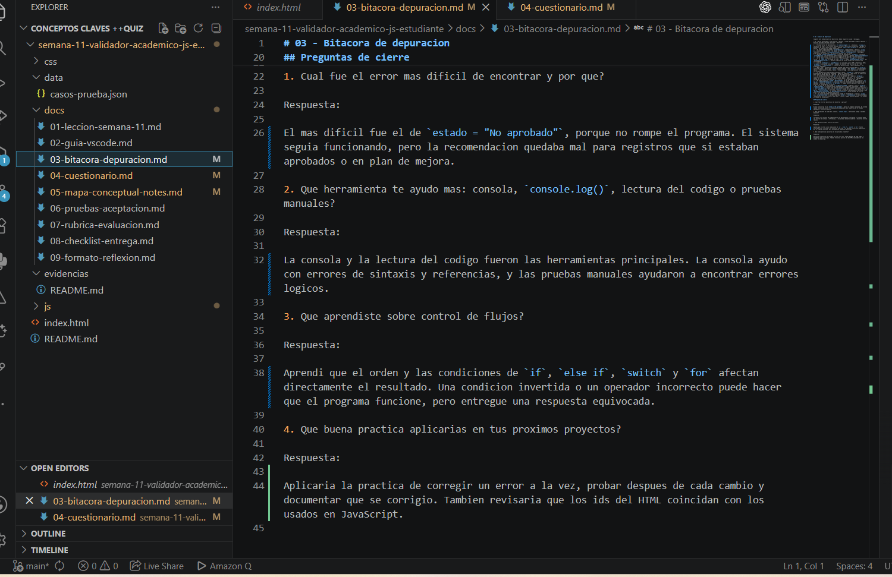

# Evidencias

En esta carpeta se guardan las capturas de pantalla usadas como soporte de la actividad de depuracion del sistema **Validador academico comunitario**.

## 1. Sistema funcionando y consola

La siguiente captura muestra el proyecto ejecutado en el navegador con la consola abierta, sin errores criticos visibles.

## 2. Documentacion diligenciada

La siguiente captura muestra la bitacora de depuracion y el cuestionario trabajados en Visual Studio Code.

## Archivos incluidos

- `evidencia-01-sistema-consola.png`
- `evidencia-02-bitacora-cuestionario.png`
